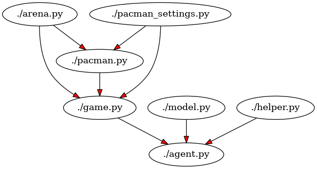

# Simple_Code_Safari
***
rebuilding the dependency schema in a python project written by others could be a tedious operation, I wrote a simple algorithm that creates a graphical structure of nodes and branches to display an image of the dependencies. It has come in handy for me on multiple occasions.

## Dependencies
1. asd
2. pydot

## Application launch
copy Simple_Code_Safari_Python.py into the project folder you want to analyze, an image called code_map.png will be created.

example:

